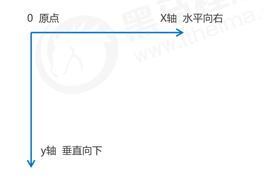

# 2D/3D 转换属性

| 属性                                                         | 说明                                       |
| :----------------------------------------------------------- | :----------------------------------------- |
| [transform](https://www.runoob.com/cssref/css3-pr-transform.html) | 适用于2D或3D转换的元素                     |
| [transform-origin](https://www.runoob.com/cssref/css3-pr-transform-origin.html) | 允许您更改转化元素位置                     |
| [transform-style](https://www.runoob.com/cssref/css3-pr-transform-style.html) | 3D空间中的指定如何嵌套元素                 |
| [perspective](https://www.runoob.com/cssref/css3-pr-perspective.html) | 指定3D元素是如何查看透视图                 |
| [perspective-origin](https://www.runoob.com/cssref/css3-pr-perspective-origin.html) | 指定3D元素底部位置                         |
| [backface-visibility](https://www.runoob.com/cssref/css3-pr-backface-visibility.html) | 定义一个元素是否应该是可见的，不对着屏幕时 |

## transform 【2D/3D转换】

> 多个属性值，之前使用空格分割。注意有先后顺序先写的优先执行

| 值                                                           | 描述                                    |
| :----------------------------------------------------------- | :-------------------------------------- |
| none                                                         | 定义不进行转换。                        |
| matrix(*n*,*n*,*n*,*n*,*n*,*n*)                              | 定义 2D 转换，使用六个值的矩阵。        |
| matrix3d(*n*,*n*,*n*,*n*,*n*,*n*,*n*,*n*,*n*,*n*,*n*,*n*,*n*,*n*,*n*,*n*) | 定义 3D 转换，使用 16 个值的 4x4 矩阵。 |
| translate(*x*,*y*)                                           | 定义 2D 转换。                          |
| translate3d(*x*,*y*,*z*)                                     | 定义 3D 转换。                          |
| translateX(*x*)                                              | 定义转换，只是用 X 轴的值。             |
| translateY(*y*)                                              | 定义转换，只是用 Y 轴的值。             |
| translateZ(*z*)                                              | 定义 3D 转换，只是用 Z 轴的值。         |
| scale(*x*[,*y*]?)                                            | 定义 2D 缩放转换。                      |
| scale3d(*x*,*y*,*z*)                                         | 定义 3D 缩放转换。                      |
| scaleX(*x*)                                                  | 通过设置 X 轴的值来定义缩放转换。       |
| scaleY(*y*)                                                  | 通过设置 Y 轴的值来定义缩放转换。       |
| scaleZ(*z*)                                                  | 通过设置 Z 轴的值来定义 3D 缩放转换。   |
| rotate(*angle*)                                              | 定义 2D 旋转，在参数中规定角度。        |
| rotate3d(*x*,*y*,*z*,*angle*)                                | 定义 3D 旋转。                          |
| rotateX(*angle*)                                             | 定义沿着 X 轴的 3D 旋转。               |
| rotateY(*angle*)                                             | 定义沿着 Y 轴的 3D 旋转。               |
| rotateZ(*angle*)                                             | 定义沿着 Z 轴的 3D 旋转。               |
| skew(*x-angle*,*y-angle*)                                    | 定义沿着 X 和 Y 轴的 2D 倾斜转换。      |
| skewX(*angle*)                                               | 定义沿着 X 轴的 2D 倾斜转换。           |
| skewY(*angle*)                                               | 定义沿着 Y 轴的 2D 倾斜转换。           |
| perspective(*n*)                                             | 为 3D 转换元素定义透视视图。            |

### 2D转换值

二维坐标系、



> https://www.runoob.com/css3/css3-2dtransforms.html

| 函数                            | 描述                                     |
| :------------------------------ | :--------------------------------------- |
| matrix(*n*,*n*,*n*,*n*,*n*,*n*) | 定义 2D 转换，使用六个值的矩阵。         |
| translate(*x*,*y*)              | 定义 2D 转换，沿着 X 和 Y 轴移动元素。   |
| translateX(*n*)                 | 定义 2D 转换，沿着 X 轴移动元素。        |
| translateY(*n*)                 | 定义 2D 转换，沿着 Y 轴移动元素。        |
| scale(*x*,*y*)                  | 定义 2D 缩放转换，改变元素的宽度和高度。 |
| scaleX(*n*)                     | 定义 2D 缩放转换，改变元素的宽度。       |
| scaleY(*n*)                     | 定义 2D 缩放转换，改变元素的高度。       |
| rotate(*angle*)                 | 定义 2D 旋转，在参数中规定角度。         |
| skew(*x-angle*,*y-angle*)       | 定义 2D 倾斜转换，沿着 X 和 Y 轴。       |
| skewX(*angle*)                  | 定义 2D 倾斜转换，沿着 X 轴。            |
| skewY(*angle*)                  | 定义 2D 倾斜转换，沿着 Y 轴。            |

#### 2D旋转

- rotate(angle)	定义 2D 旋转

  - angle 角度值 -360deg ~ 360deg

  ```css
  transform:rotate(7deg);
  ```

<div style="width: 100px;height: 100px; background: red; transform: rotate(10deg);">旋转</div>


- rotateX(x)—— x轴旋转
- rotateY(y)——y轴旋转

**总结；**

- 角度为整数，顺时针，负数，为逆时针 
- 默认旋转的中心点是元素的中心点

#### 2D缩放

- scale(x,y)——缩放值可以是小数

  - x轴缩放
  - y轴缩放

  ```css
  transform: scale(2,2);
  ```


<div style="width: 50px;height: 50px; background: red; transform: scale(2,2);">放大2倍</div>


- scaleX(x)—— x轴缩放
- scaleY(y)——  y轴缩放

**总结；**

- transform:scale(1,1) ：宽和高都放大一倍，相对于没有放大 
- transform:scale(2,2) ：宽和高都放大了2倍 
- transform:scale(2) ：只写一个参数，第二个参数则和第一个参数一样，相当于 scale(2,2) 
- transform:scale(0.5,0.5)：缩小
- 不会影响其它盒子


#### 2D平移

- translate(x,y)——移动位置

  - x轴移动

  - y轴移动

	```css
	transform: translate(-10px,20px);
	```

<div style="width: 100px;height: 100px; background: red; transform: translate(100px,20px);">移动位置</div>


- translateX(x)—— x轴移动
- translateY(y)—— y 轴移动

**总结；**

- 定义 2D 转换，沿着 X 和 Y 轴移动元素 
- translate中的百分比单位是相对于自身为参考 translate:(50%,50%); 利用这个特性在定位章节中我们让盒子居中最后让盒子margin设置为自身的一般可以使用此来代替。
- translate类似定位，不会影响到其他元素的位置 
- **对行内标签没有效果**

#### 2D倾斜

- transform:skew(\<angle> [,\<angle>]);包含两个参数值，分别表示X轴和Y轴倾斜的角度，如果第二个参数为空，则默认为0，参数为负表示向相反方向倾斜。
  - X(\<angle>);表示X轴(水平方向)倾斜。
  - Y(\<angle>);表示Y轴(垂直方向)倾斜。

  ```css
  transform: skew(20deg,10deg);
  ```

<div style="width: 100px;height: 100px; background: red; transform: skew(-20deg,10deg)">倾斜</div>


- skewX(\<angle>);表示只在X轴(水平方向)倾斜。
- skewY(\<angle>);表示只在Y轴(垂直方向)倾斜。


#### 2D矩阵

- matrix() 方法和2D变换方法合并成一个。

  - matrix 方法有六个参数，包含旋转，缩放，移动（平移）和倾斜功能。

    ```css
    transform:matrix(0.866,0.5,-0.5,0.866,0,0);
    -ms-transform:matrix(0.866,0.5,-0.5,0.866,0,0); /* IE 9 */
    -webkit-transform:matrix(0.866,0.5,-0.5,0.866,0,0); /* Safari and Chrome */
    ```

  

### 3D转换值

> https://www.runoob.com/css3/css3-3dtransforms.html

**轴向参考；**


| 函数                                                         | 描述                                      |
| :----------------------------------------------------------- | :---------------------------------------- |
| matrix3d(*n*,*n*,*n*,*n*,*n*,*n*, *n*,*n*,*n*,*n*,*n*,*n*,*n*,*n*,*n*,*n*) | 定义 3D 转换，使用 16 个值的 4x4 矩阵。   |
| translate3d(*x*,*y*,*z*)                                     | 定义 3D 转化。                            |
| translateX(*x*)                                              | 定义 3D 转化，仅使用用于 X 轴的值。       |
| translateY(*y*)                                              | 定义 3D 转化，仅使用用于 Y 轴的值。       |
| translateZ(*z*)                                              | 定义 3D 转化，仅使用用于 Z 轴的值。       |
| scale3d(*x*,*y*,*z*)                                         | 定义 3D 缩放转换。                        |
| scaleX(*x*)                                                  | 定义 3D 缩放转换，通过给定一个 X 轴的值。 |
| scaleY(*y*)                                                  | 定义 3D 缩放转换，通过给定一个 Y 轴的值。 |
| scaleZ(*z*)                                                  | 定义 3D 缩放转换，通过给定一个 Z 轴的值。 |
| rotate3d(*x*,*y*,*z*,*angle*)                                | 定义 3D 旋转。                            |
| rotateX(*angle*)                                             | 定义沿 X 轴的 3D 旋转。                   |
| rotateY(*angle*)                                             | 定义沿 Y 轴的 3D 旋转。                   |
| rotateZ(*angle*)                                             | 定义沿 Z 轴的 3D 旋转。                   |
| perspective(*n*)                                             | 定义 3D 转换元素的透视视图。              |

- translate3d(*x*,*y*,*z*) 三个参数，分别是 x, y, z 三轴的移动距离，当 x = 10px ，代表物件会在 x 轴上往右移动 10px 

  


  

  


#### 3D平移

- translate3d(x,y,z) 定义3d平移

#### 3D旋转

> 了解，物件是对著什么东西旋转，一般在 2D 的画面中，物件是要对著某一个点旋转，而在 3D 画面则是要对著某一条线来旋转，也就是刚提到的旋转轴。

- rotate3d(*x*,*y*,*z*,*angle*) 定义3D旋转 (x, y, z) 三个值与 原点 (0, 0, 0) 形成的一条线，称为*旋转轴*，物件会对著该轴来做旋转，而 第四个参数 degree 则是旋转角度。


- rotateY(angle)

  

- rotateX(angle)

  

- rotateZ(angle)

  

**总结；**

从上面的几个旋转方法看出，物件只是在原地旋转，因为物件的中心点 (0, 0, 0)，刚好就在旋转轴上，不管对著 x, y ,z 哪个轴旋转，中心点 (0, 0, 0) 都被这三个轴穿过，所以物件旋转的时候，中心点是不会变动的。

#### 30缩放

- scale3d() 定义3d缩放

#### 3D矩阵

- matrix3d(*n*,*n*,*n*,*n*,*n*,*n*, *n*,*n*,*n*,*n*,*n*,*n*,*n*,*n*,*n*,*n*)   定义 3D 转换，使用 16 个值的 4x4 矩阵


### transform-origin【设置转换元素的中心点】

> https://www.runoob.com/cssref/css3-pr-transform-origin.html

```css
div
{
transform: rotate(45deg);
transform-origin:20% 40%;
-ms-transform: rotate(45deg); /* IE 9 */
-ms-transform-origin:20% 40%; /* IE 9 */
-webkit-transform: rotate(45deg); /* Safari and Chrome */
-webkit-transform-origin:20% 40%; /* Safari and Chrome */
}
```


**属性值；**

| **值** | **描述**                                                     |
| ------ | ------------------------------------------------------------ |
| x-axis | 定义视图被置于 X 轴的何处。可能的值：left   center  right  *length*  % |
| y-axis | 定义视图被置于 Y 轴的何处。可能的值： top  center   bottom *length*  % |
| z-axis | 定义视图被置于 Z 轴的何处。可能的值：  *length*              |

 


**总结；**

- xy值使用空格分隔
- 支持2d和3d元素设置
- `transform-origin:50% 50%;` 默认是元素中心点

