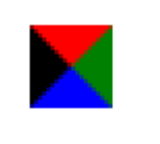

# border【边框和轮廓】

| 属性                                                         | 描述                                                         |
| ------------------------------------------------------------ | ------------------------------------------------------------ |
| [border](https://www.runoob.com/cssref/pr-border.html)       | 复合属性。设置对象边框的特性。                               |
| [border-bottom](https://www.runoob.com/cssref/pr-border-bottom.html) | 复合属性。设置对象底部边框的特性。                           |
| [border-bottom-color](https://www.runoob.com/cssref/pr-border-bottom-color.html) | 设置或检索对象的底部边框颜色。                               |
| [border-bottom-style](https://www.runoob.com/cssref/pr-border-bottom-style.html) | 设置或检索对象的底部边框样式。                               |
| [border-bottom-width](https://www.runoob.com/cssref/pr-border-bottom-width.html) | 设置或检索对象的底部边框宽度。                               |
| [border-color](https://www.runoob.com/cssref/pr-border-color.html) | 置或检索对象的边框颜色。                                     |
| [border-left](https://www.runoob.com/cssref/pr-border-left.html) | 复合属性。设置对象左边边框的特性。                           |
| [border-left-color](https://www.runoob.com/cssref/pr-border-left-color.html) | 设置或检索对象的左边边框颜色。                               |
| [border-left-style](https://www.runoob.com/cssref/pr-border-left-style.html) | 设置或检索对象的左边边框样式。                               |
| [border-left-width](https://www.runoob.com/cssref/pr-border-left-width.html) | 设置或检索对象的左边边框宽度。                               |
| [border-right](https://www.runoob.com/cssref/pr-border-right.html) | 复合属性。设置对象右边边框的特性。                           |
| [border-right-color](https://www.runoob.com/cssref/pr-border-right-color.html) | 设置或检索对象的右边边框颜色。                               |
| [border-right-style](https://www.runoob.com/cssref/pr-border-right-style.html) | 设置或检索对象的右边边框样式。                               |
| [border-right-width](https://www.runoob.com/cssref/pr-border-right-width.html) | 设置或检索对象的右边边框宽度。                               |
| [border-style](https://www.runoob.com/cssref/pr-border-style.html) | 设置或检索对象的边框样式。                                   |
| [border-top](https://www.runoob.com/cssref/pr-border-top.html) | 复合属性。设置对象顶部边框的特性。                           |
| [border-top-color](https://www.runoob.com/cssref/pr-border-top-color.html) | 设置或检索对象的顶部边框颜色                                 |
| [border-top-style](https://www.runoob.com/cssref/pr-border-top-style.html) | 设置或检索对象的顶部边框样式。                               |
| [border-top-width](https://www.runoob.com/cssref/pr-border-top-width.html) | 设置或检索对象的顶部边框宽度。                               |
| [border-width](https://www.runoob.com/cssref/pr-border-width.html) | 设置或检索对象的边框宽度。                                   |
| [outline](https://www.runoob.com/cssref/pr-outline.html)     | 复合属性。设置或检索对象外的线条轮廓。                       |
| [outline-color](https://www.runoob.com/cssref/pr-outline-color.html) | 设置或检索对象外的线条轮廓的颜色。                           |
| [outline-style](https://www.runoob.com/cssref/pr-outline-style.html) | 设置或检索对象外的线条轮廓的样式。                           |
| [outline-width](https://www.runoob.com/cssref/pr-outline-width.html) | 设置或检索对象外的线条轮廓的宽度。                           |
| [border-bottom-left-radius](https://www.runoob.com/cssref/css3-pr-border-bottom-left-radius.html) | 设置或检索对象的左下角圆角边框。提供2个参数，2个参数以空格分隔，每个参数允许设置1个参数值，第1个参数表示水平半径，第2个参数表示垂直半径，如第2个参数省略，则默认等于第1个参数 |
| [border-bottom-right-radius](https://www.runoob.com/cssref/css3-pr-border-bottom-right-radius.html) | 设置或检索对象的右下角圆角边框。                             |
| [border-image](https://www.runoob.com/cssref/css3-pr-border-image.html) | 设置或检索对象的边框样式使用图像来填充。                     |
| [border-image-outset](https://www.runoob.com/cssref/css3-pr-border-image-outset.html) | 规定边框图像超过边框的量。                                   |
| [border-image-repeat](https://www.runoob.com/cssref/css3-pr-border-image-repeat.html) | 规定图像边框是否应该被重复（repeated）、拉伸（stretched）或铺满（rounded）。 |
| [border-image-slice](https://www.runoob.com/cssref/css3-pr-border-image-slice.html) | 规定图像边框的向内偏移。                                     |
| [border-image-source](https://www.runoob.com/cssref/css3-pr-border-image-source.html) | 规定要使用的图像，代替 border-style 属性中设置的边框样式。   |
| [border-image-width](https://www.runoob.com/cssref/css3-pr-border-image-width.html) | 规定图像边框的宽度。                                         |
| [border-radius](https://www.runoob.com/cssref/css3-pr-border-radius.html) | 设置或检索对象使用圆角边框。                                 |
| [border-top-left-radius](https://www.runoob.com/cssref/css3-pr-border-top-left-radius.html) | 定义左上角边框的形状。                                       |
| [border-top-right-radius](https://www.runoob.com/cssref/css3-pr-border-top-right-radius.html) | 定义右上角边框的形状。                                       |
| box-decoration-break                                         | 规定行内元素被折行                                           |
| [box-shadow](https://www.runoob.com/cssref/css3-pr-box-shadow.html) | 向方框添加一个或多个阴影。                                   |

## border-style

- `solid` 实线
- `dashed` 虚线
- `dotted` 点线

## border-radius

border有8个控制圆角的数值。

```css
border-radius: 1-4 length|% / 1-4 length|%;
举例；border-radius : 50px 50px 50px 50px / 50px 50px 50px 50px;
```

- 斜杠前面1~4个值为水平圆角
- 斜杠后面1·~4值为垂直圆角


## outline 

```css
    outline: none; //主要适用input  去除焦点框
```

outline设置轮廓属性

- `outline-color`设置轮廓颜色
- `outline-style`设置轮廓样式
- `outline-width`设置轮廓宽度

## box-shadow  

边框阴影 参数 右 下 透明度 颜色

## 三角形之美

```css
 div {

     width: 0; 
    height: 0;
    line-height:0；
    font-size: 0;
    border-top: 10px solid red;

    border-right: 10px solid green;

    border-bottom: 10px solid blue;

    border-left: 10px solid #000; 

 }
```

一张图， 你就知道 css 三角是怎么来的了, 做法如下：



1. 我们用css 边框可以模拟三角效果
2. 宽度高度为0
3. 我们4个边框都要写， 只保留需要的边框颜色，其余的不能省略，都改为 transparent 透明就好了
4. 为了照顾兼容性 低版本的浏览器，加上 font-size: 0; line-height: 0;

