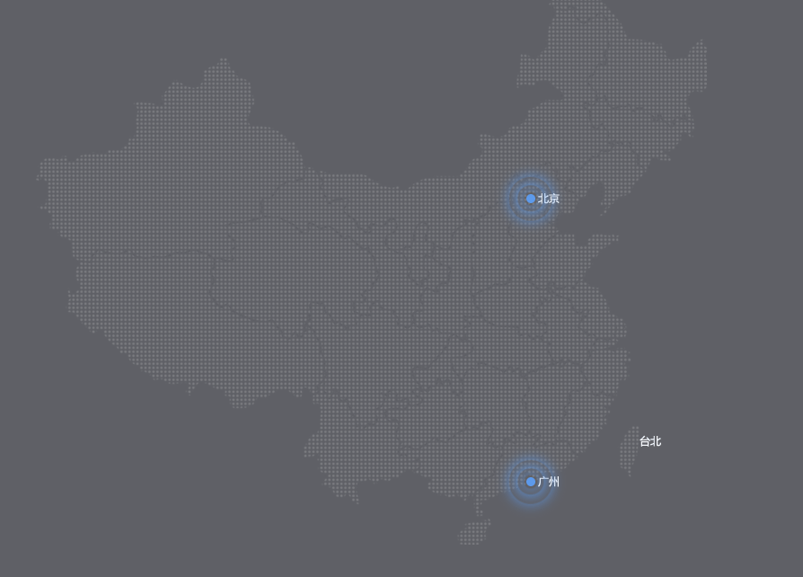

# 大数据热点图波纹效果



```html
<!DOCTYPE html>
<html lang="en">

<head>
    <meta charset="UTF-8">
    <meta http-equiv="X-UA-Compatible" content="IE=edge">
    <meta name="viewport" content="width=device-width, initial-scale=1.0">
    <title>热点图</title>
    <style>
        body {
            background-color: rgb(95, 96, 102);
        }

        .map {
            position: relative;
            width: 747px;
            height: 617px;
            margin: auto;
            background: url(img/map.png) no-repeat;
        }

        .bj {
            position: absolute;
            top: 227px;
            right: 191px;
        }
        .gz {
            position: absolute;
            bottom: 65px;
            right: 191px;
        }

        .point {
            width: 10px;
            height: 10px;
            background-color: rgb(93, 154, 235);
            border-radius: 50%;
        }

        div[class^="circle"] {
            position: absolute;
            top: 50%;
            left: 50%;
            /*保证在父元素内垂直水平居中*/
            transform: translate(-50%, -50%);
            width: 10px;
            height: 10px;
            border-radius: 50%;
            /*使用阴影更柔和*/
            box-shadow: 0 0 15px rgb(93, 154, 235);
            animation: pulse 1.2s linear infinite;
        }   
        .city .circle2 {
            animation-delay: 0.4s;
        }
        .city .circle3 {
            animation-delay: 0.8s;
        }
        @keyframes pulse {
            0% {

            }
            70% {
                width: 40px;
                height: 40px;
                opacity: 1;
            }

            100% {
                width: 70px;
                height: 70px;
                opacity: 0;
            }
        }
    </style>
</head>

<body>
    <div class="map">
        <div class="city bj">
            <div class="point"></div>
            <div class="circle1"></div>
            <div class="circle2"></div>
            <div class="circle3"></div>
        </div>
        <div class="city gz">
            <div class="point"></div>
            <div class="circle1"></div>
            <div class="circle2"></div>
            <div class="circle3"></div>
        </div>
    </div>
</body>

</html>
```

