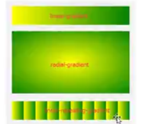
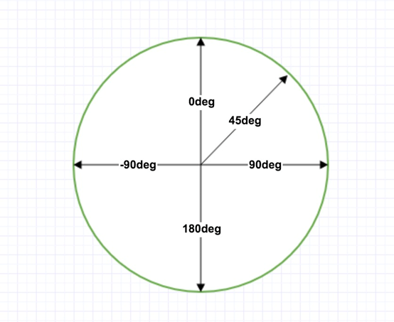

# CSS函数

| 函数                                                         | 描述                                                         | CSS 版本 |
| ------------------------------------------------------------ | ------------------------------------------------------------ | -------- |
| [attr()](https://www.runoob.com/cssref/func-attr.html)       | 返回选择元素的属性值。                                       | 2        |
| [calc()](https://www.runoob.com/cssref/func-calc.html)       | 允许计算 CSS 的属性值，比如动态计算长度值。                  | 3        |
| [cubic-bezier()](https://www.runoob.com/cssref/func-cubic-bezier.html) | 定义了一个贝塞尔曲线(Cubic Bezier)。                         | 3        |
| [hsl()](https://www.runoob.com/cssref/func-hsl.html)         | 使用色相、饱和度、亮度来定义颜色。                           | 3        |
| [hsla()](https://www.runoob.com/cssref/func-hsla.html)       | 使用色相、饱和度、亮度、透明度来定义颜色。                   | 3        |
| [linear-gradient()](https://www.runoob.com/cssref/func-linear-gradient.html) | 创建一个线性渐变的图像                                       | 3        |
| [radial-gradient()](https://www.runoob.com/cssref/func-radial-gradient.html) | 用径向渐变创建图像。                                         | 3        |
| [repeating-linear-gradient()](https://www.runoob.com/cssref/func-repeating-linear-gradient.html) | 用重复的线性渐变创建图像。                                   | 3        |
| [repeating-radial-gradient()](https://www.runoob.com/cssref/func-repeating-radial-gradient.html) | 类似 radial-gradient()，用重复的径向渐变创建图像。           | 3        |
| [rgb()](https://www.runoob.com/cssref/func-rgb-css.html)     | 使用红(R)、绿(G)、蓝(B)三个颜色的叠加来生成各式各样的颜色。  | 2        |
| [rgba()](https://www.runoob.com/cssref/func-rgba.html)       | 使用红(R)、绿(G)、蓝(B)、透明度(A)的叠加来生成各式各样的颜色。 | 3        |
| [var()](https://www.runoob.com/cssref/func-var.html)         | 用于插入自定义的属性值。                                     | 3        |

## 滤镜

> https://www.runoob.com/cssref/css3-pr-filter.html

- `filter` 滤镜

**注意:**

滤镜通常使用百分比 (如：75%), 当然也可以使用小数来表示 (如：0.75)。

| Filter                                             | 描述                                                         |
| -------------------------------------------------- | ------------------------------------------------------------ |
| none                                               | 默认值，没有效果。                                           |
| blur(*px*)                                         | 给图像设置高斯模糊。"radius"一值设定高斯函数的标准差，或者是屏幕上以多少像素融在一起， 所以值越大越模糊； 如果没有设定值，则默认是0；这个参数可设置css长度值，但不接受百分比值。 |
| brightness(*%*)                                    | 给图片应用一种线性乘法，使其看起来更亮或更暗。如果值是0%，图像会全黑。值是100%，则图像无变化。其他的值对应线性乘数效果。值超过100%也是可以的，图像会比原来更亮。如果没有设定值，默认是1。 |
| contrast(*%*)                                      | 调整图像的对比度。值是0%的话，图像会全黑。值是100%，图像不变。值可以超过100%，意味着会运用更低的对比。若没有设置值，默认是1。 |
| drop-shadow(*h-shadow v-shadow blur spread color*) | 给图像设置一个阴影效果。阴影是合成在图像下面，可以有模糊度的，可以以特定颜色画出的遮罩图的偏移版本。 函数接受(在CSS3背景中定义)类型的值，除了"inset"关键字是不允许的。该函数与已有的box-shadow box-shadow属性很相似；不同之处在于，通过滤镜，一些浏览器为了更好的性能会提供硬件加速。`参数如下：``**** **** (必须)这是设置阴影偏移量的两个 值. **** 设定水平方向距离. 负值会使阴影出现在元素左边. ****设定垂直距离.负值会使阴影出现在元素上方。查看****可能的单位.**如果两个值都是0**, 则阴影出现在元素正后面 (如果设置了 and/or ，会有模糊效果).**** (可选)这是第三个code>值. 值越大，越模糊，则阴影会变得更大更淡.不允许负值 若未设定，默认是0 (则阴影的边界很锐利).**** (可选)这是第四个 值. 正值会使阴影扩张和变大，负值会是阴影缩小.若未设定，默认是0 (阴影会与元素一样大小). 注意: Webkit, 以及一些其他浏览器 不支持第四个长度，如果加了也不会渲染。 **** (可选)查看 该值可能的关键字和标记。若未设定，颜色值基于浏览器。在Gecko (Firefox), Presto (Opera)和Trident (Internet Explorer)中， 会应用color**color**属性的值。另外, 如果颜色值省略，WebKit中阴影是透明的。` |
| grayscale(*%*)                                     | 将图像转换为灰度图像。值定义转换的比例。值为100%则完全转为灰度图像，值为0%图像无变化。值在0%到100%之间，则是效果的线性乘子。若未设置，值默认是0； |
| hue-rotate(*deg*)                                  | 给图像应用色相旋转。"angle"一值设定图像会被调整的色环角度值。值为0deg，则图像无变化。若值未设置，默认值是0deg。该值虽然没有最大值，超过360deg的值相当于又绕一圈。 |
| invert(*%*)                                        | 反转输入图像。值定义转换的比例。100%的价值是完全反转。值为0%则图像无变化。值在0%和100%之间，则是效果的线性乘子。 若值未设置，值默认是0。 |
| opacity(*%*)                                       | 转化图像的透明程度。值定义转换的比例。值为0%则是完全透明，值为100%则图像无变化。值在0%和100%之间，则是效果的线性乘子，也相当于图像样本乘以数量。 若值未设置，值默认是1。该函数与已有的opacity属性很相似，不同之处在于通过filter，一些浏览器为了提升性能会提供硬件加速。 |
| saturate(*%*)                                      | 转换图像饱和度。值定义转换的比例。值为0%则是完全不饱和，值为100%则图像无变化。其他值，则是效果的线性乘子。超过100%的值是允许的，则有更高的饱和度。 若值未设置，值默认是1。 |
| sepia(*%*)                                         | 将图像转换为深褐色。值定义转换的比例。值为100%则完全是深褐色的，值为0%图像无变化。值在0%到100%之间，则是效果的线性乘子。若未设置，值默认是0； |
| url()                                              | URL函数接受一个XML文件，该文件设置了 一个SVG滤镜，且可以包含一个锚点来指定一个具体的滤镜元素。例如：`filter: url(svg-url#element-id)` |
| initial                                            | 设置属性为默认值，可参阅： [CSS initial 关键字](https://www.runoob.com/cssref/css-initial.html) |
| inherit                                            | 从父元素继承该属性，可参阅：[CSS inherit 关键字](https://www.runoob.com/cssref/css-inherit.html) |

## 渐变

> 适用于background和background-image属性

**渐变类型；**

1. 线性渐变
2. 径向渐变
3. 重复渐变



### 线性渐变

> 更多参考https://www.runoob.com/cssref/func-linear-gradient.html

**格式；**

`linear-gradient（渐变方向可以是对角/角度值，颜色）`

- 渐变起始点色位置和指定渐变位置相反，
  - 如；从左侧开始的线性渐变，从红色开始，转为黄色:
  - 那么这里从左侧开始，指定方位词应该是相反的所以应该写right

####  **角度参考**

- 角度是指水平线和渐变线之间的角度，逆时针方向计算。换句话说，
  - 0deg 将创建一个从下到上的渐变，
  - 90deg 将创建一个从左到右的渐变。

- 但是，请注意很多浏览器(Chrome,Safari,fiefox等)的使用了旧的标准，
  - 即 0deg 将创建一个从左到右的渐变，
  - 90deg 将创建一个从下到上的渐变。
  - 换算公式 90 - x = y 其中 x 为标准角度，y为非标准角度。



```css
/* 从左侧开始的线性渐变，从红色开始，转为黄色: */
background-image: linear-gradient(to right, red , yellow);

/* 通过方位词渐变，从左上角到右下角的线性渐变: */
background-image: linear-gradient(to bottom right, red , yellow);

/* 指定角度渐变 */
background-image: linear-gradient(180deg, red, yellow);

```

<div id="line_grad" style="width:100px;height:100px;background-image:linear-gradient(to right, red , yellow)">从左边开始，从红色渐变到黄色 </div>


### 径向渐变

> https://www.runoob.com/cssref/func-radial-gradient.html

**格式；**

`radial-gradient（起始中心点，形状，尺寸，颜色）`

- 起始点；可以是方位词等

  - circle ：指定圆形的径向渐变

- 形状；circle 表示圆形，ellipse 表示椭圆形。默认值是 ellipse。

- 尺寸；

  - closest-side 最近端

  - farthest-side 最远端

  - closest-corner 最近角

  - farthest-corner 最远角

```css
background-image: radial-gradient(red, green, blue);
```


<div id="line_grad" style="width:100px;height:100px;background-image:radial-gradient(red, yellow, pink)">径向渐变</div>


### 重复渐变

> https://www.runoob.com/cssref/func-repeating-linear-gradient.html

**格式；**

`repeating-linear-gradient(角度，起始色,渐变色1占比，渐变色2占比)`


```css
  background-image: repeating-linear-gradient(red, yellow 10%, green 20%);
```


<div id="line_grad" style="width:100px;height:100px;  background-image: repeating-linear-gradient(red, yellow 10%, green 20%);">重复渐变</div>

