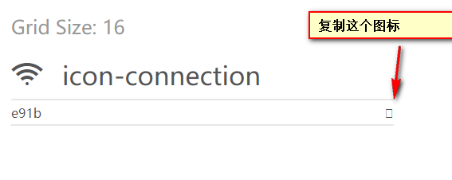

# 字体图标

 **字体图标库**

http://fontawesome.dashgame.com/（第三方图标库）

https://icomoon.io/（自定义图标）

http://icomoon.io/

## 字体引入到HTML

得到压缩包之后，我们得知字体图标 本质就是 字体文件。

最后一步，是最重要的一步了， 就是字体文件已经有了，我们需要引入到我们页面中。

1. 首先把 fonts文件夹放入我们 根目录下 。

   #####  html标签内里面添加结构

   

   ```css
    <span></span>  
   ```

   ##### 在样式里面声明字体： 告诉别人我们自己定义的字体(一定注意字体文件路径的问题)

   ```css
   @font-face {
     font-family: 'icomoon';
     src:  url('fonts/icomoon.eot?7kkyc2');
     src:  url('fonts/icomoon.eot?7kkyc2#iefix') format('embedded-opentype'),
       url('fonts/icomoon.ttf?7kkyc2') format('truetype'),
       url('fonts/icomoon.woff?7kkyc2') format('woff'),
       url('fonts/icomoon.svg?7kkyc2#icomoon') format('svg');
     font-weight: normal;
     font-style: normal;
   }
   ```

   ##### 给盒子使用字体

   ```css
   span {
           font-family: "icomoon";
       }
   ```
