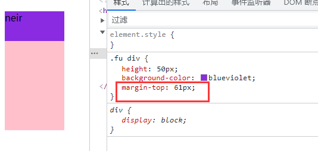

# margin【外边距】

**注意；**

1. 上下外边距会叠压

2. 盒子嵌套，为子级设置``margin-top`会传给父级导致父级盒子margin变化子级位置不变这叫**外边距塌陷**；

   

   **解决方案：**
   
   1. 可以为父元素定义上边框。
   2. 可以为父元素定义上内边距
   3. 可以为父元素添加`overflow:hidden`。
   
   还有其他方法，比如浮动、固定、绝对定位的盒子不会有问题。

| 属性                                                         | 说明                           |
| ------------------------------------------------------------ | ------------------------------ |
| [margin](https://www.runoob.com/cssref/pr-margin.html)       | 在一个声明中设置所有外边距属性 |
| [margin-bottom](https://www.runoob.com/cssref/pr-margin-bottom.html) | 设置元素的下外边距             |
| [margin-left](https://www.runoob.com/cssref/pr-margin-left.html) | 设置元素的左外边距             |
| [margin-right](https://www.runoob.com/cssref/pr-margin-right.html) | 设置元素的右外边距             |
| [margin-top](https://www.runoob.com/cssref/pr-margin-top.html) | 设置元素的上外边距             |

## auto值

自动分配剩余的空间。

注意：

- 行内元素为了照顾兼容性， 尽量只设置左右内外边距， 不要设置上下内外边距。

