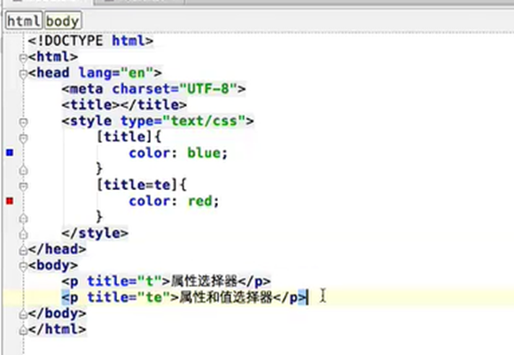

# 选择器

| 选择器                                                       | 示例                  | 示例说明                                                  | CSS  |
| ------------------------------------------------------------ | --------------------- | --------------------------------------------------------- | ---- |
| [.*class*](https://www.runoob.com/cssref/sel-class.html)     | .intro                | 选择所有class="intro"的元素                               | 1    |
| [#*id*](https://www.runoob.com/cssref/sel-id.html)           | #firstname            | 选择所有id="firstname"的元素                              | 1    |
| [*](https://www.runoob.com/cssref/sel-all.html)              | *                     | 选择所有元素                                              | 2    |
| *[element](https://www.runoob.com/cssref/sel-element.html)*  | p                     | 选择所有元素                                              | 1    |
| *[element,element](https://www.runoob.com/cssref/sel-element-comma.html)* | div,p                 | 选择所有元素和元素                                        | 1    |
| [*element* *element*](https://www.runoob.com/cssref/sel-element-element.html) | div p                 | 选择元素内的所有元素                                      | 1    |
| [*element*>*element*](https://www.runoob.com/cssref/sel-element-gt.html) | div>p                 | 选择所有父级是元素的元素                                  | 2    |
| [*element*+*element*](https://www.runoob.com/cssref/sel-element-pluss.html) | div+p                 | 选择所有紧接着元素之后的元素                              | 2    |
| [[*attribute*\]](https://www.runoob.com/cssref/sel-attribute.html) | [target]              | 选择所有带有target属性元素                                | 2    |
| [[*attribute*=*value*\]](https://www.runoob.com/cssref/sel-attribute-value.html) | [target=-blank]       | 选择所有使用target="-blank"的元素                         | 2    |
| [[*attribute*~=*value*\]](https://www.runoob.com/cssref/sel-attribute-value-contains.html) | [title~=flower]       | 选择标题属性包含单词"flower"的所有元素                    | 2    |
| [[*attribute*\|=*language*\]](https://www.runoob.com/cssref/sel-attribute-value-lang.html) | [lang\|=en]           | 选择 lang 属性以 en 为开头的所有元素                      | 2    |
| [:link](https://www.runoob.com/cssref/sel-link.html)         | a:link                | 选择所有未访问链接                                        | 1    |
| [:visited](https://www.runoob.com/cssref/sel-visited.html)   | a:visited             | 选择所有访问过的链接                                      | 1    |
| [:active](https://www.runoob.com/cssref/sel-active.html)     | a:active              | 选择活动链接                                              | 1    |
| [:hover](https://www.runoob.com/cssref/sel-hover.html)       | a:hover               | 选择鼠标在链接上面时                                      | 1    |
| [:focus](https://www.runoob.com/cssref/sel-focus.html)       | input:focus           | 选择具有焦点的输入元素                                    | 2    |
| [:first-letter](https://www.runoob.com/cssref/sel-firstletter.html) | p:first-letter        | 选择每一个元素的第一个字母                                | 1    |
| [:first-line](https://www.runoob.com/cssref/sel-firstline.html) | p:first-line          | 选择每一个元素的第一行                                    | 1    |
| [:first-child](https://www.runoob.com/cssref/sel-firstchild.html) | p:first-child         | 指定只有当元素是其父级的第一个子级的样式。                | 2    |
| [:before](https://www.runoob.com/cssref/sel-before.html)     | p:before              | 在每个元素之前插入内容                                    | 2    |
| [:after](https://www.runoob.com/cssref/sel-after.html)       | p:after               | 在每个元素之后插入内容                                    | 2    |
| [:lang(*language*)](https://www.runoob.com/cssref/sel-lang.html) | p:lang(it)            | 选择一个lang属性的起始值="it"的所有元素                   | 2    |
| [*element1*~*element2*](https://www.runoob.com/cssref/sel-gen-sibling.html) | p~ul                  | 选择p元素之后的每一个ul元素                               | 3    |
| [[*attribute*^=*value*\]](https://www.runoob.com/cssref/sel-attr-begin.html) | a[src^="https"]       | 选择每一个src属性的值以"https"开头的元素                  | 3    |
| [[*attribute*$=*value*\]](https://www.runoob.com/cssref/sel-attr-end.html) | a[src$=".pdf"]        | 选择每一个src属性的值以".pdf"结尾的元素                   | 3    |
| [[*attribute**=*value*\]](https://www.runoob.com/cssref/sel-attr-contain.html) | a[src*="runoob"]      | 选择每一个src属性的值包含子字符串"runoob"的元素           | 3    |
| [:first-of-type](https://www.runoob.com/cssref/sel-first-of-type.html) | p:first-of-type       | 选择每个p元素是其父级的第一个p元素                        | 3    |
| [:last-of-type](https://www.runoob.com/cssref/sel-last-of-type.html) | p:last-of-type        | 选择每个p元素是其父级的最后一个p元素                      | 3    |
| [:only-of-type](https://www.runoob.com/cssref/sel-only-of-type.html) | p:only-of-type        | 选择每个p元素是其父级的唯一p元素                          | 3    |
| [:only-child](https://www.runoob.com/cssref/sel-only-child.html) | p:only-child          | 选择每个p元素是其父级的唯一子元素                         | 3    |
| [:nth-child(*n*)](https://www.runoob.com/cssref/sel-nth-child.html) | p:nth-child(2)        | 选择每个p元素是其父级的第二个子元素                       | 3    |
| [:nth-last-child(*n*)](https://www.runoob.com/cssref/sel-nth-last-child.html) | p:nth-last-child(2)   | 选择每个p元素的是其父级的第二个子元素，从最后一个子项计数 | 3    |
| [:nth-of-type(*n*)](https://www.runoob.com/cssref/sel-nth-of-type.html) | p:nth-of-type(2)      | 选择每个p元素是其父级的第二个p元素                        | 3    |
| [:nth-last-of-type(*n*)](https://www.runoob.com/cssref/sel-nth-last-of-type.html) | p:nth-last-of-type(2) | 选择每个p元素的是其父级的第二个p元素，从最后一个子项计数  | 3    |
| [:last-child](https://www.runoob.com/cssref/sel-last-child.html) | p:last-child          | 选择每个p元素是其父级的最后一个子级。                     | 3    |
| [:root](https://www.runoob.com/cssref/sel-root.html)         | :root                 | 选择文档的根元素                                          | 3    |
| [:empty](https://www.runoob.com/cssref/sel-empty.html)       | p:empty               | 选择每个没有任何子级的p元素（包括文本节点）               | 3    |
| [:target](https://www.runoob.com/cssref/sel-target.html)     | #news:target          | 选择当前活动的#news元素（包含该锚名称的点击的URL）        | 3    |
| [:enabled](https://www.runoob.com/cssref/sel-enabled.html)   | input:enabled         | 选择每一个已启用的输入元素                                | 3    |
| [:disabled](https://www.runoob.com/cssref/sel-disabled.html) | input:disabled        | 选择每一个禁用的输入元素                                  | 3    |
| [:checked](https://www.runoob.com/cssref/sel-checked.html)   | input:checked         | 选择每个选中的输入元素                                    | 3    |
| [:not(*selector*)](https://www.runoob.com/cssref/sel-not.html) | :not(p)               | 选择每个并非p元素的元素                                   | 3    |
| [::selection](https://www.runoob.com/cssref/sel-selection.html) | ::selection           | 匹配元素中被用户选中或处于高亮状态的部分                  | 3    |
| [:out-of-range](https://www.runoob.com/cssref/sel-out-of-range.html) | :out-of-range         | 匹配值在指定区间之外的input元素                           | 3    |
| [:in-range](https://www.runoob.com/cssref/sel-in-range.html) | :in-range             | 匹配值在指定区间之内的input元素                           | 3    |
| [:read-write](https://www.runoob.com/cssref/sel-read-write.html) | :read-write           | 用于匹配可读及可写的元素                                  | 3    |
| [:read-only](https://www.runoob.com/cssref/sel-read-only.html) | :read-only            | 用于匹配设置 "readonly"（只读） 属性的元素                | 3    |
| [:optional](https://www.runoob.com/cssref/sel-optional.html) | :optional             | 用于匹配可选的输入元素                                    | 3    |
| [:required](https://www.runoob.com/cssref/sel-required.html) | :required             | 用于匹配设置了 "required" 属性的元素                      | 3    |
| [:valid](https://www.runoob.com/cssref/sel-valid.html)       | :valid                | 用于匹配输入值为合法的元素                                | 3    |
| [:invalid](https://www.runoob.com/cssref/sel-invalid.html)   | :invalid              | 用于匹配输入值为非法的元素                                | 3    |

## 复合选择器

CSS选择器分为 基础选择器（如id，class选择器） 和 复合选择器 ，但是基础选择器不能满足我们实际开发中，快速高效的选择标签。

- 目的是为了可以选择更准确更精细的目标元素标签。
- 复合选择器是由**两个或多个基础选择器**，**通过不同的方式组合而成的**


## Id和class选择器

工作常用class

## 元素选择器

元素选择器 根据元素名选择（样式前直接加标签类型）

## 通配符（不常用）

`*`选中页面中所有的元素

## 后代/包含选择器

用来选择元素或元素组的**子孙后代**

后代选择器可以通过一层关系找到下一层可以**隔代选择**,只要是父元素的子级就可以被选择到。

- 其写法就是把外层标签写在前面，内层标签写在后面，中间用**空格**分隔，先写父亲爷爷，在写儿子孙子。

  ```
  父级 子级{属性:属性值;属性:属性值;}
  ```

## 子元素选择器

子元素选择器只能选择作为某元素**子元素(亲儿子)**的元素。

子元素选择器又叫直接自带选择器，不可以隔代选择只能一层一层的选择

- 其写法就是把父级标签写在前面，子级标签写在后面，中间跟一个 `>` 进行连接

## 相领兄弟选择器

可以选择紧接在另一个元素后的元素，且二者有相同父元素。

例子；

H1+p{样式只有p元素生效 必须是同一个父级}

## 交集选择器

**条件**

交集选择器由两个选择器构成，找到的标签必须满足：既有标签一的特点，也有标签二的特点。


**语法：**


其中第一个为标签选择器，第二个为class选择器，两个选择器之间**不能有空格**，如`h3.special`。

**记忆技巧：**

交集选择器 是 并且的意思。 即...又...的意思

```
比如：   p.one   选择的是： 类名为 .one  的 段落标签。  
```

用的相对来说比较少，不太建议使用。

## 并集选择器（重点）

**应用：**

- 如果某些选择器定义的相同样式，就可以利用并集选择器，可以让代码更简洁。

- 并集选择器（CSS选择器分组）是各个选择器通过`,`连接而成的，通常用于集体声明。

**语法：**


- 任何形式的选择器（包括标签选择器、class类选择器id选择器等），都可以作为并集选择器的一部分。

**记忆技巧：**

并集选择器通常用于集体声明 ，逗号隔开的，所有选择器都会执行后面样式，逗号可以理解为 和的意思。

```
比如  .one, p , #test {color: #F00;}  
表示   .one 和 p  和 #test 这三个选择器都会执行颜色为红色。 
通常用于集体声明。  
```

## 属性选择器

；[title]

有两种分有数值和无数值；



4、     属性值和属性选择属性值必须完全匹配

例子；a标签的href 

[href如果有值必须和要使用的值完全匹配]{style样式}

<a href=”设置值 ”>a标签</a>

5、     根据部分属性选择只要具备部分被选择值就会生效

例子；

`[title~=”title”]{样式}`

① <p title=”title完全匹配 ”>holler</p>

② <p title=”title hello部分具备”>holle</p>

③ <p title=”titl不具备被选择值 ”>holle</p>

生效；①和②

