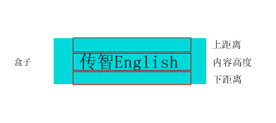

# 文本

| 属性                                                         | 说明                                                  |
| ------------------------------------------------------------ | ----------------------------------------------------- |
| [color](https://www.runoob.com/cssref/pr-text-color.html)    | 设置文本的颜色                                        |
| [direction](https://www.runoob.com/cssref/pr-text-direction.html) | 规定文本的方向 / 书写方向                             |
| [letter-spacing](https://www.runoob.com/cssref/pr-text-letter-spacing.html) | 设置字符间距                                          |
| [line-height](https://www.runoob.com/cssref/pr-dim-line-height.html) | 设置行高                                              |
| [text-align](https://www.runoob.com/cssref/pr-text-text-align.html) | 规定文本的水平对齐方式                                |
| [text-decoration](https://www.runoob.com/cssref/pr-text-text-decoration.html) | 规定添加到文本的装饰效果                              |
| [text-indent](https://www.runoob.com/cssref/pr-text-text-indent.html) | 规定文本块首行的缩进                                  |
| [text-transform](https://www.runoob.com/cssref/pr-text-text-transform.html) | 控制文本的大小写                                      |
| unicode-bidi                                                 |                                                       |
| [vertical-align](https://www.runoob.com/cssref/pr-pos-vertical-align.html) | 设置元素的垂直对齐方式                                |
| [white-space](https://www.runoob.com/cssref/pr-text-white-space.html) | 设置怎样给一元素控件留白                              |
| [word-spacing](https://www.runoob.com/cssref/pr-text-word-spacing.html) | 设置单词间距                                          |
| [text-emphasis](https://www.runoob.com/cssref/css3-pr-text-emphasis.html) | 向元素的文本应用重点标记以及重点标记的前景色。        |
| [hanging-punctuation](https://www.runoob.com/cssref/css3-pr-hanging-punctuation.html) | 指定一个标点符号是否可能超出行框                      |
| [punctuation-trim](https://www.runoob.com/cssref/css3-pr-punctuation-trim.html) | 指定一个标点符号是否要去掉                            |
| [text-align-last](https://www.runoob.com/cssref/css3-pr-text-align-last.html) | 当 text-align 设置为 justify 时，最后一行的对齐方式。 |
| [text-justify](https://www.runoob.com/cssref/css3-pr-text-justify.html) | 当 text-align 设置为 justify 时指定分散对齐的方式。   |
| [text-outline](https://www.runoob.com/cssref/css3-pr-text-outline.html) | 设置文字的轮廓。                                      |
| [text-overflow](https://www.runoob.com/cssref/css3-pr-text-overflow.html) | 指定当文本溢出包含的元素，应该发生什么                |
| [text-shadow](https://www.runoob.com/cssref/css3-pr-text-shadow.html) | 为文本添加阴影                                        |
| [text-wrap](https://www.runoob.com/cssref/css3-pr-text-wrap.html) | 指定文本换行规则                                      |
| [word-break](https://www.runoob.com/cssref/css3-pr-word-break.html) | 指定非CJK文字的断行规则                               |
| [word-wrap](https://www.runoob.com/cssref/css3-pr-word-wrap.html) | 设置浏览器是否对过长的单词进行换行。                  |

## 常用设置

- `font size`——文字大小（中文最小12px都是偶数）

- `font family`——文字字体（可以直接跟中文字体名加逗号继续跟其它字体airal英文常用字体）

- `color`——字体颜色除用颜色单词外其它写法#十六位颜色码也可以用rgb（rgb颜色码每种以逗号隔开）

- `line-height`——行高(文字间隙=行高-字体大小除以2)文字上下居中的方法设置一个和盒子一样的行高

- `text-align`——文本对齐方式

- `text-indent`——首行缩进（1em=缩进1个字）

- `font-weight`——文字着重（bold粗体normal或400正常）

- `font-style`——文字倾斜（italic斜体）

- `text-decoration`——文字修饰（underline下划线）（line through中划线或删除线）（overline上划线）none没有

- `letter-spacing`——字母间距

- `word-spacing`——单词间距（以空格为解析单位）

- `text-transform` 元素中的字母规定字母的大小写及单词首字母大写。

   | 值         | 描述                                           |
   | :--------- | :--------------------------------------------- |
   | none       | 默认。定义带有小写字母和大写字母的标准的文本。 |
   | capitalize | 文本中的每个单词以大写字母开头。               |
   | uppercase  | 定义仅有大写字母。                             |
   | lowercase  | 定义无大写字母，仅有小写字母。                 |
   | inherit    | 规定应该从父元素继承 text-transform 属性的值。 |

- `text-shadow`向文本添加阴影

   四个参数；距离文本左 距离文本上 阴影大小 颜色
   
- font:综合设置字体样式 (重点) ，font属性用于对字体样式进行综合设置

   ```css
   选择器 { font: font-style  font-weight  font-size/line-height  font-family;}
   ```

   - 使用font属性时，必须按上面语法格式中的顺序书写，不能更换顺序，各个属性以**空格**隔开。
   - 其中不需要设置的属性可以省略（取默认值），但必须保留font-size和font-family属性，否则font属性将不起作用。

## 行高（line-height）

**行高的测量方法：**


上方文本和下方文本之间基线的距离叫行高


### 单行文本垂直居中

行高我们利用最多的一个地方是： 可以让单行文本在盒子中垂直居中对齐。

> **文字的行高等于盒子的高度。**

行高 = 上距离 + 内容高度 + 下距离



上距离和下距离总是相等的，因此文字看上去是垂直居中的。

**行高和高度的三种关系**

- 如果 行高 等 高度 文字会 垂直居中
- 如果行高 大于 高度 文字会 偏下
- 如果行高小于高度 文字会 偏上

