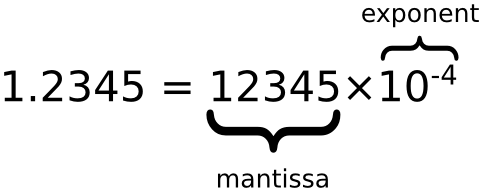

# Number【数字】

JavaScript 只有一种数字类型。

## 数字定义

### 科学计数法

极大或极小的数字可通过科学（指数）计数法来写：

```js
var y=123e5;    // 12300000
var z=123e-5;   // 0.00123
```

### 数据或对象

数字可以私有数据进行初始化，就像 

```js
var x = 123;
```

JavaScript 数字对象初始化数据，

```js
 var y = new Number(123);
```

## 存储形式

**所有 JavaScript 数字均为 64 位**

JavaScript 不是类型语言。与许多其他编程语言不同，JavaScript 不定义不同类型的数字，比如整数、短、长、浮点等等。

在JavaScript中，数字不分为整数类型和浮点型类型，所有的数字都是由 浮点型类型。JavaScript 采用 IEEE754 标准定义的 64 位浮点格式表示数字，它能表示最大值（Number.MAX_VALUE）为 **±1.7976931348623157e+308**，最小值（Number.MIN_VALUE）为 **±5e-324**。

此格式用 64 位存储数值，其中 0 到 51 存储数字（片段），52 到 62 存储指数，63 位存储符号：


| 值 (aka Fraction/Mantissa) | 指数（Exponent）  | 符号（Sign） |
| :------------------------- | :---------------- | :----------- |
| 52 bits (0 - 51)           | 11 bits (52 - 62) | 1 bit (63)   |



## 精度

整数（不使用小数点或指数计数法）最多为 15 位。

```js
var x = 999999999999999;   // x 为 999999999999999
var y = 9999999999999999;  // y 为 10000000000000000
```

小数的最大位数是 17，但是浮点运算并不总是 100% 准确：

```js
var x = 0.2+0.1; // 输出结果为 0.30000000000000004
```


## 八进制和十六进制

如果前缀为 0，则 JavaScript 会把数值常量解释为八进制数，如果前缀为 0 和 "x"，则解释为十六进制数。

```js
var y = 0377;
var z = 0xFF;
```

默认情况下，JavaScript 数字为十进制显示。

可以使用 toString() 方法 输出16进制、8进制、2进制。

```js
var myNumber=128;
myNumber.toString(16);   // 返回 80
myNumber.toString(8);    // 返回 200
myNumber.toString(2);    // 返回 10000000
```

## 无穷大（Infinity）

`当数字运算结果超过了JavaScript所能表示的数字上限（溢出），结果为一个特殊的无穷大（infinity）值，在JavaScript中以Infinity表示。同样地，当负数的值超过了JavaScript所能表示的负数范围，结果为负无穷大，在JavaScript中以-Infinity表示。无穷大值的行为特性和我们所期望的是一致的：基于它们的加、减、乘和除运算结果还是无穷大（当然还保留它们的正负号

除以0也产生了无限:

````js
var x = 2/0;	// Infinity
var y = -2/0;	// -Infinity
````

## NaN 非数字值

NaN 属性是代表非数字值的特殊值。该属性用于指示某个值不是数字。可以把 Number 对象设置为该值，来指示其不是数字值。

可以使用 `isNaN()` 全局函数来判断一个值是否是 NaN 值。

## Number 属性

| 属性                     | 描述                                                  |
| :----------------------- | :---------------------------------------------------- |
| Number.MAX_VALUE         | 最大值                                                |
| Number.MIN_VALUE         | 最小值                                                |
| Number.NaN               | 非数字                                                |
| Number.NEGATIVE_INFINITY | 负无穷，在溢出时返回                                  |
| Number.POSITIVE_INFINITY | 正无穷，在溢出时返回                                  |
| Number.EPSILON           | 表示 1 和比最接近 1 且大于 1 的最小 Number 之间的差别 |
| Number.MIN_SAFE_INTEGER  | 最小安全整数。                                        |
| Number.MAX_SAFE_INTEGER  | 最大安全整数。                                        |

## Number方法

| 方法                   | 描述                                                         |
| :--------------------- | :----------------------------------------------------------- |
| Number.parseFloat()    | 将字符串转换成浮点数，和全局方法 [parseFloat()](https://www.runoob.com/jsref/jsref-parsefloat.html) 作用一致。 |
| Number.parseInt()      | 将字符串转换成整型数字，和全局方法 [parseInt()](https://www.runoob.com/jsref/jsref-parseint.html) 作用一致。 |
| Number.isFinite()      | 判断传递的参数是否为有限数字。                               |
| Number.isInteger()     | 判断传递的参数是否为整数。                                   |
| Number.isNaN()         | 判断传递的参数是否为 isNaN()。                               |
| Number.isSafeInteger() | 判断传递的参数是否为安全整数。                               |

## Number类型原型上的一些方法

| 方法            | 描述                                                         |
| :-------------- | :----------------------------------------------------------- |
| toExponential() | 返回一个数字的指数形式的字符串，如：1.23e+2                  |
| toFixed()       | 返回指定小数位数的表示形式。`var a=123; b=a.toFixed(2); // b="123.00"` |
| toPrecision()   | 返回一个指定精度的数字。如下例子中，a=123 中，3会由于精度限制消失:`var a=123; b=a.toPrecision(2); // b="1.2e+2"` |

