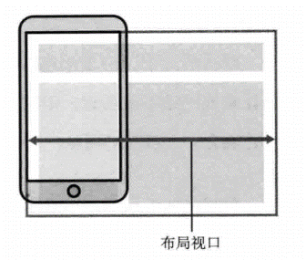
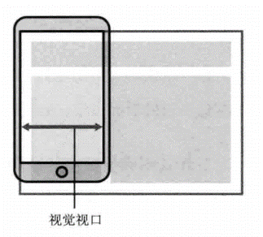
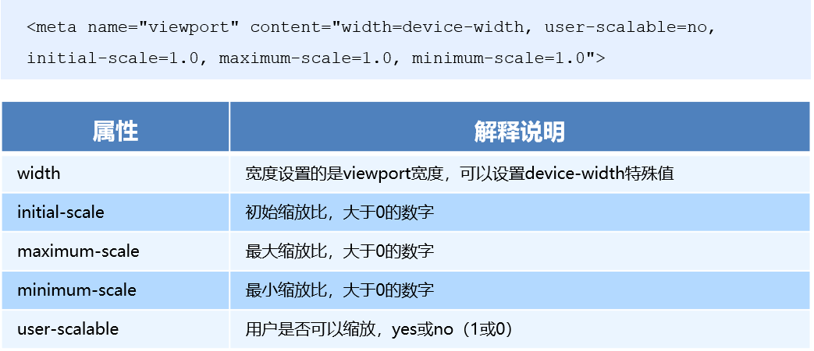
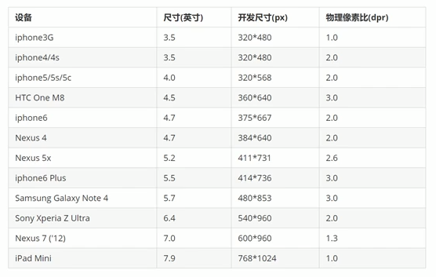

# 介绍

## 视口

视口（viewport）就是浏览器显示页面内容的屏幕区域。 视口可以分为布局视口、视觉视口和理想视口

### 布局视口 layout viewport

一般移动设备的浏览器都默认设置了一个布局视口，用于解决早期的PC端页面在手机上显示的问题。

iOS, Android基本都将这个视口分辨率设置为 980px，所以PC上的网页大多都能在手机上呈现，只不过元素看上去很小，一般默认可以通过手动缩放网页。

### 视觉视口 visual viewport

字面意思，它是用户正在看到的网站的区域。注意：是网站的区域。

我们可以通过缩放去操作视觉视口，但不会影响布局视口，布局视口仍保持原来的宽度。

### 理想视口 ideal viewport

为了使网站在移动端有最理想的浏览和阅读宽度而设定

理想视口，对设备来讲，是最理想的视口尺寸

需要手动添写meta视口标签通知浏览器操作

meta视口标签的主要目的：布局视口的宽度应该与理想视口的宽度一致，简单理解就是设备有多宽，我们布局的视口就多宽

**总结：我们开发最终会用理想视口，而理想视口就是将布局视口的宽度修改为视觉视口**

### meta标签

最标准的viewport设置

- 视口宽度和设备保持一致
- 视口的默认缩放比例1.0
- 不允许用户自行缩放
- 最大允许的缩放比例1.0
- 最小允许的缩放比例1.0

## 二倍视图

**物理像素；**

物理像素 = 移动设备的真实分辨率

**开发像素；**

开发像素 = css像素

往往开发像素会比物理像素多2倍或更多，

如在iPhone8中1px开发像素= 2px物理像素。

### 多倍图

准备的图片，比实际使用图片大两倍这种就叫倍图。

