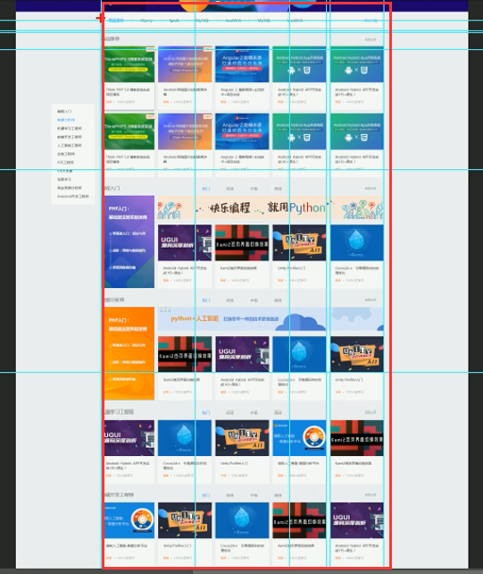
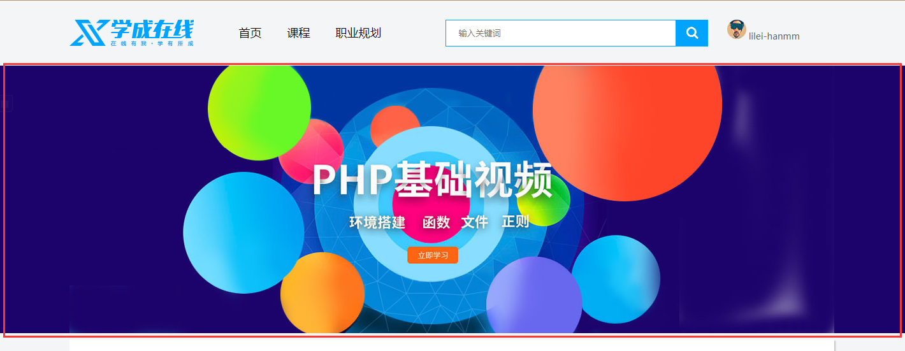

# 布局

## 布局流程

为了提高网页制作的效率，布局时通常有以下的布局流程，具体如下：

1、必须确定页面的版心（可视区）， 我们测量可得知。

2、分析页面中的行模块，以及每个行模块中的列模块。其实页面布局，就是一行行罗列而成

3、制作HTML结构。我们还是遵循，先有结构，后有样式的原则。结构永远最重要。

4、然后开始运用盒子模型的原理，通过DIV+CSS布局来控制网页的各个模块。


## 页面的版心

页面可视区主要展示给用户观看的内容，通常是**居中显示**网页被缩放依然如此。有**单独的盒子承载**。包含版心内容的盒子往往都会有以下class属性。

```css
.w {
    width: 1200px;
    margin: auto;
}
```



## 多个a标签排列

为了避免因大量链接连续出现导致的网站被搜索引擎降权。

通常是将a放到`li` 无需列表中列表外面套盒子，如，常见导航或页脚中的链接

导航

```html
<nav>
        <ul>
            <li><a href="">首页</a></li>
            <li><a href="">课程</a></li>
            <li><a href="">职业规划</a></li>
        </ul>
</nav>
```

页脚链接

```html
            <dl>
                <dd>合作伙伴</dd>
                <li><a href="">合作机构</a></li>
                <li><a href="">合作导师</a></li>
            </dl>
```


## banner 横幅




- 在指定background属性时通常会设置底色，这个底色是以banner图主色来定义,图片定位也在中心。

  ```css
  background: #1c036c url("./images/banner2.jpg") no-repeat top center;
  ```

  