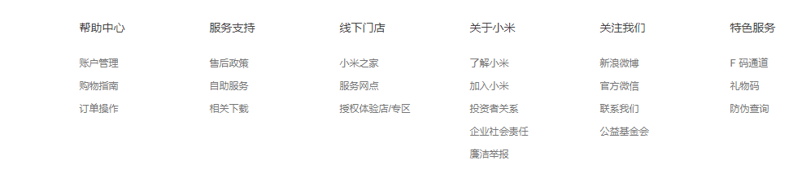
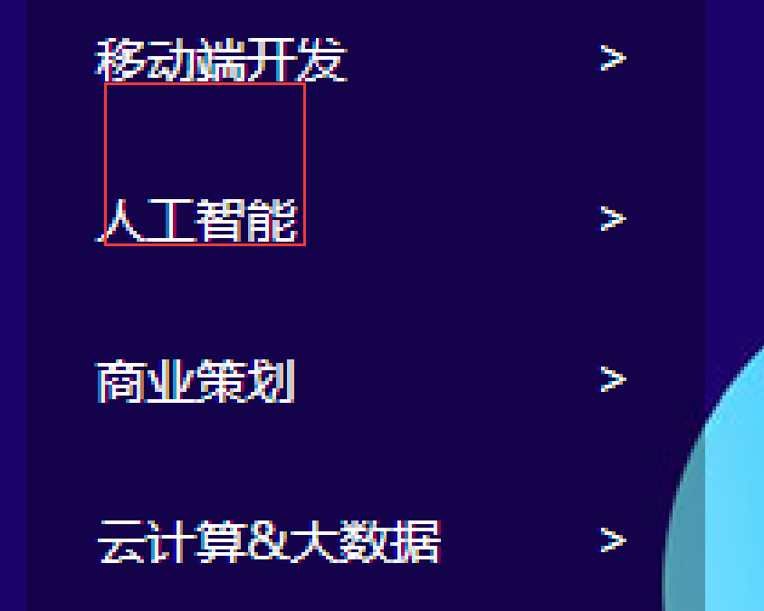
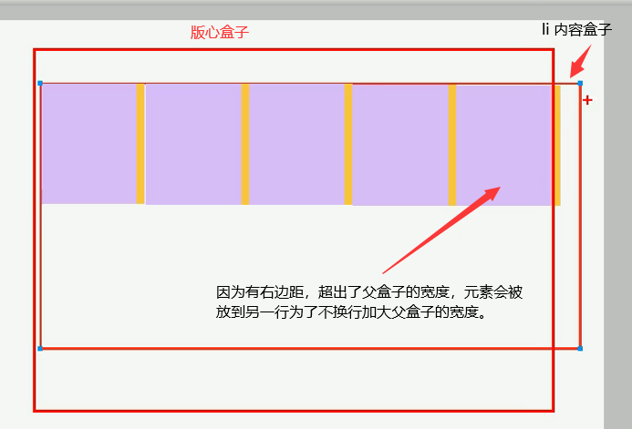
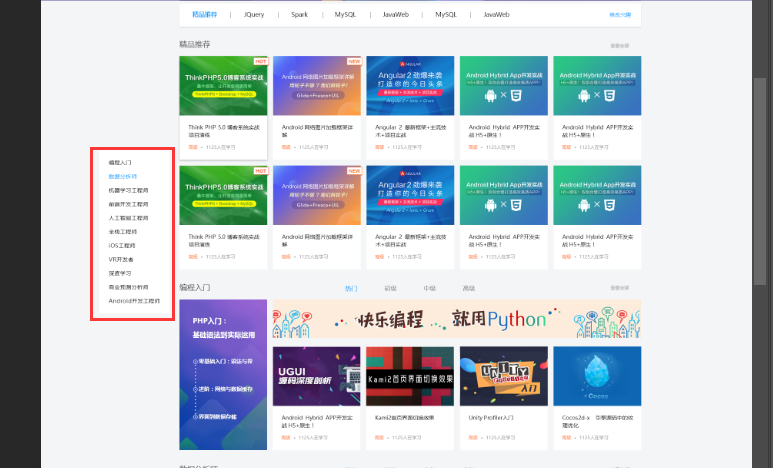
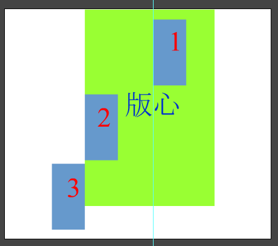
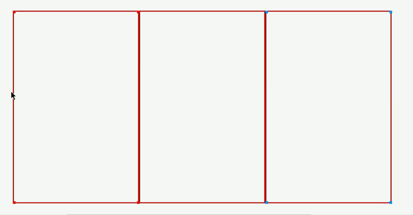
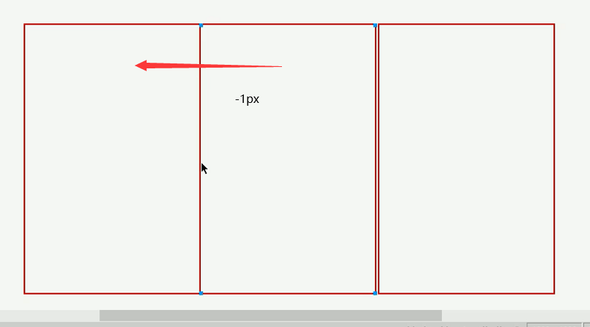
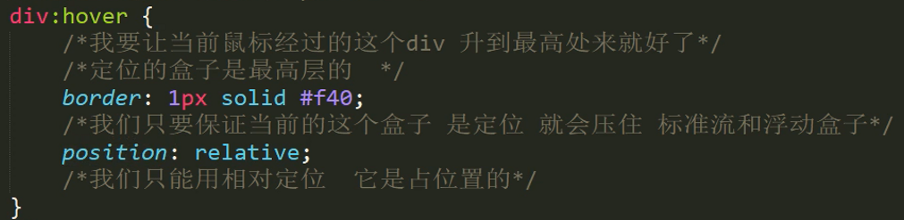

# 布局

## 布局流程

为了提高网页制作的效率，布局时通常有以下的布局流程，具体如下：

1、必须确定页面的版心（可视区）， 我们测量可得知。

2、分析页面中的行模块，以及每个行模块中的列模块。其实页面布局，就是一行行罗列而成

3、制作HTML结构。我们还是遵循，先有结构，后有样式的原则。结构永远最重要。

4、然后开始运用盒子模型的原理，通过DIV+CSS布局来控制网页的各个模块。


## 页面的版心

页面可视区主要展示给用户观看的内容，通常是**居中显示**网页被缩放依然如此。有**单独的盒子承载**。包含版心内容的盒子往往都会有以下class属性。

```css
.w {
    width: 1200px;
    margin: auto;
}
```


## 多个a标签排列

为了避免因大量链接连续出现导致的网站被搜索引擎降权。

通常是将a放到`li` 无需列表中列表外面套盒子，如，常见导航或页脚中的链接

导航

```html
<nav>
        <ul>
            <li><a href="">首页</a></li>
            <li><a href="">课程</a></li>
            <li><a href="">职业规划</a></li>
        </ul>
</nav>
```

页脚链接

```html
  <dl>
                <dt>合作伙伴</dt>
                <dd><a href="">合作机构</a></dd>
                <dd><a href="">合作导师</a></dd>
   </dl>
```


## banner 横幅


- 在指定background属性时通常会设置底色，这个底色是以banner图主色来定义,图片定位也在中心。

  ```css
  background: #1c036c url("./images/banner2.jpg") no-repeat top center;
  ```

  

## 自定义列表 dl

自定义列表 常用用于制作页脚中的链接模块。



```html
  <dl>
                <dt>合作伙伴</dt>
                <dd><a href="">合作机构</a></dd>
                <dd><a href="">合作导师</a></dd>
            </dl>
```


## 其它做法

- 想导航栏中的链接，文本个数不确定那么就不要指定其width，我们使用padding来撑开其宽度

- 列表行与行之间的距离测量也就是行高，从上一个盒子的文本底部到当前盒子文本的底部。然后为盒子设置这个得到的高度，设置了高度列表之间的距离就自然拉开了最后设置文本垂直居中即可。

  

- 版心盒子内的内容盒子是可以版心盒子宽的

  

## 图片使用

- 商品图片等使用插入图片，也就是img标签

- 图标等使用background设置图片


## 侧边栏贴靠版心




1. 先让侧边栏往左50%到达浏览器视图一般
2. 在往右移动版心宽度的一般，到达版心边缘
3. 在往左移动同侧边栏宽度的距离。margin-left
4. 其它方向移动也是如此类推




## 网页布局总结

一个完整的网页，有标准流 、 浮动 、 定位 一起完成布局的。每个都有自己的专门用法。

### 标准流

可以让盒子上下排列 或者 左右排列的

### 浮动

可以让多个块级元素一行显示 或者 左右对齐盒子 浮动的盒子就是按照顺序左右排列

### 定位

定位最大的特点是有层叠的概念，就是可以让多个盒子 前后 叠压来显示。 但是每个盒子需要测量数值。


## 浮动盒子边框不重叠



我们虽然可以去除一些边框来达到清除的目的，我们有更简单的方法给盒子设置负的margin值让其盖住重叠部分的边框

因为盒子使用了浮动会紧贴在一起所以不会出现原地踏步现象。



如果要设置hover边框样式需要这样写



