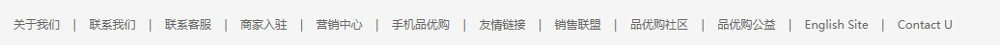
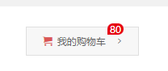
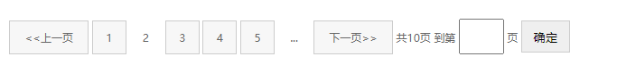
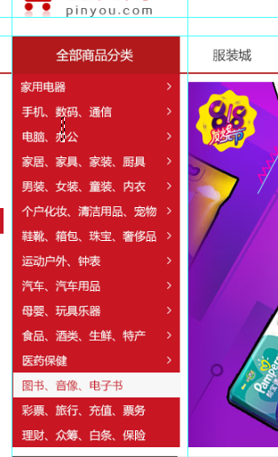
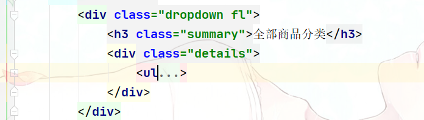
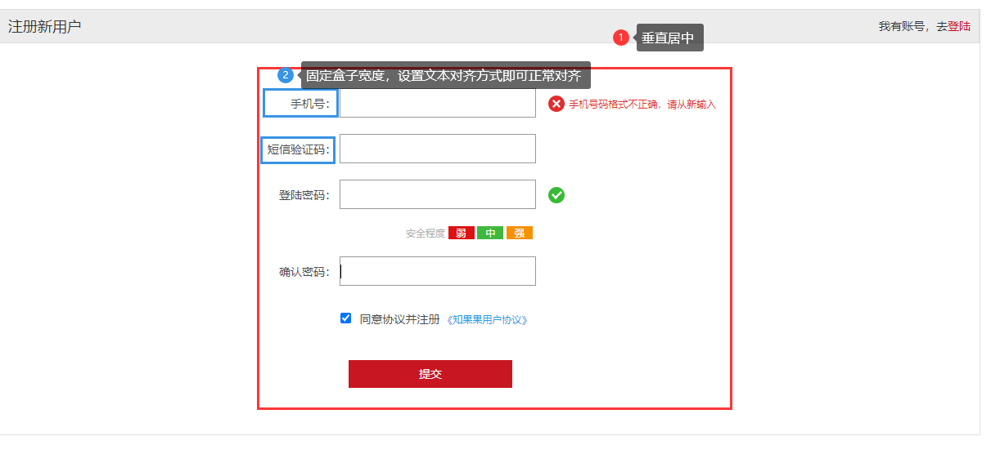
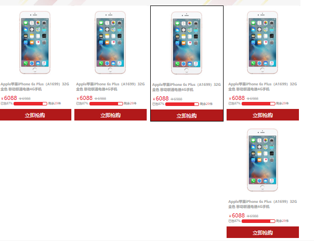

# 布局

## 布局流程

为了提高网页制作的效率，布局时通常有以下的布局流程，具体如下：

1、必须确定页面的版心（可视区）， 我们测量可得知。

2、分析页面中的行模块，以及每个行模块中的列模块。其实页面布局，就是一行行罗列而成

3、制作HTML结构。我们还是遵循，先有结构，后有样式的原则。结构永远最重要。

4、然后开始运用盒子模型的原理，通过DIV+CSS布局来控制网页的各个模块。


## 页面的版心

页面可视区主要展示给用户观看的内容，通常是**居中显示**网页被缩放依然如此。有**单独的盒子承载**。包含版心内容的盒子往往都会有以下class属性。

```css
.w {
    width: 1200px;
    margin: auto;
}
```


## 多个a标签排列

为了避免因大量链接连续出现导致的网站被搜索引擎降权。

通常是将a放到`li` 无需列表中列表外面套盒子，如，常见导航或页脚中的链接

导航

```html
<nav>
        <ul>
            <li><a href="">首页</a></li>
            <li><a href="">课程</a></li>
            <li><a href="">职业规划</a></li>
        </ul>
</nav>
```

页脚链接

```html
  <dl>
                <dt>合作伙伴</dt>
                <dd><a href="">合作机构</a></dd>
                <dd><a href="">合作导师</a></dd>
   </dl>
```


## banner 横幅


- 在指定background属性时通常会设置底色，这个底色是以banner图主色来定义,图片定位也在中心。

  ```css
  background: #1c036c url("./images/banner2.jpg") no-repeat top center;
  ```

  

## 自定义列表 dl

自定义列表 常用用于制作页脚中的链接模块。


```html
  <dl>
                <dt>合作伙伴</dt>
                <dd><a href="">合作机构</a></dd>
                <dd><a href="">合作导师</a></dd>
            </dl>
```


## 其它做法

- 想导航栏中的链接，文本个数不确定那么就不要指定其width，我们使用padding来撑开其宽度

- 如果设计图中没有给定每个列表项大小列表行与行之间的距离测量也就是行高，从上一个盒子的文本底部到当前盒子文本的底部。然后为盒子设置这个得到的高度，设置了高度列表之间的距离就自然拉开了最后设置文本垂直居中即可。

  

- 版心盒子内的内容盒子是可以版心盒子宽的

  

- 想这种效果可以使用span包含`|` 给span加margin让其撑开a标签

  

  ```html
  <p class="mod_copyright_links">
                  <a href="#">关于我们</a>
                  <span>|</span>
                  <a href="#">联系我们</a>
                  <span>|</span>
                  <a href="#">联系客服</a>
  </p>
  ```

  ````css
  .mod_copyright_links span{
      margin: 0 10px;
  }
  ````

  

## 图片使用

- 商品图片等使用插入图片，也就是img标签

- 图标等使用background设置图片


## 侧边栏贴靠版心


1. 先让侧边栏往左50%到达浏览器视图一般
2. 在往右移动版心宽度的一般，到达版心边缘
3. 在往左移动同侧边栏宽度的距离。margin-left
4. 其它方向移动也是如此类推


## 网页布局总结

一个完整的网页，有标准流 、 浮动 、 定位 一起完成布局的。每个都有自己的专门用法。

### 标准流

可以让盒子上下排列 或者 左右排列的

### 浮动

可以让多个块级元素一行显示 或者 左右对齐盒子 浮动的盒子就是按照顺序左右排列

### 定位

定位最大的特点是有层叠的概念，就是可以让多个盒子 前后 叠压来显示。 但是每个盒子需要测量数值。


## 浮动盒子边框不重叠


我们虽然可以去除一些边框来达到清除的目的，我们有更简单的方法给盒子设置负的margin值让其盖住重叠部分的边框

因为盒子使用了浮动会紧贴在一起所以不会出现原地踏步现象。


如果要设置hover边框样式需要这样写


## logo优化

- logo 里面 首先放一个 h1 标签 ，目的是为了提权，告诉搜索引擎，这个地方很重要
- h1里面在放一个连接，可以返回首页的， 给连接一个 大小 和 logo 的背景图片
- 连接 里面要放文字（网站名称），为了搜索引擎收录我们。 但是文字不要显示出来
  - 要用 text-indent 移到盒子外面 （text-indent: -9999px) 然后overflow:hidden 淘宝的做法
  - 直接给font-size: 0; 就看不到文字了， 京东的做法。
- 最后给 连接一个 title 这样鼠标放到logo 上， 就可以看到提示文字了

```html
<div class="logo">
        <h1>
            <a href="index.html" title="品优购">品优购</a>
        </h1>
    </div>
```

````css
.logo h1 a {
    display: block;
    width: 171px;
    height: 61px;
    font-size: 0;
    background-image: url("../img/logo.png");
}
````


## 提醒小红点

- count 统计部分 不要给宽度，因为可能买的件数比较多，让件数撑开就好了 给一个高度
- 一定注意左下角 不是圆角 其余三个是圆角



````html
<i class="count">8</i>
````

````css
.count {
    position: absolute;
    top: -5px;
    /*文本增多时我们应该让其往左走所以要使用左偏移而非右偏移*/
    left: 105px;
    height: 14px;
    padding: 0 3px;
    line-height: 14px;
    text-align: center;
    color: #fefefe;
    background-color: #e60012;
    border-radius: 5px 5px 5px 0;
}
````

## 分页模块

使用行内块元素来布局方便对齐



```html
<div class="page">
            <span class="page_index">
                <a href="#" class="page_previous">&lt;&lt;上一页</a>
                <a href="#">1</a>
                <a href="#" class="current">2</a>
                <a href="#">3</a>
                <a href="#">4</a>
                <a href="#">5</a>
                <a href="#" class="page_more">...</a>
                <a href="#" class="page_next">下一页&gt;&gt;</a>
            </span>
            <span class="page_skip">
                共10页 到第
                <input type="text">
                页
                <button>确定</button>
            </span>
    </div>
```


```css
.page {
    margin: 20px 0;
    text-align: center;
}
.page_index a{
    display: inline-block;
    width: 36px;
    height: 36px;
    background-color: #f7f7f7;
    border: 1px solid #ccc;
    line-height: 36px;

}
.page .page_more ,
.page .current{
    border: 1px solid transparent;
    background-color: transparent;
}
.page .page_previous ,
.page .page_next{
    width: 86px;
}
.page_skip input {
    width: 46px;
    height: 36px;
    text-align: center;
    transition: all .3s;
}
.page_skip input:focus {
    width: 90px;
    border: 1px solid #c81623;
}
.page_skip button {
    display: inline-block;
    width: 54px;
    height: 36px;
    border: 1px solid #ccc;
}
```


## 侧边导航



划分，一个大盒子包含两个子盒子





## 注册页面布局



- 表单盒子按内容所需设置宽高然后垂直居中
- 像这种行列布局的表单可以使用ul li来布局
- 左侧的采集信息名称可以使用label和表单元素进行绑定，要想让采集信息名称靠右对齐可以先为其设置一个固定的宽度然后让文本右对齐。

```html
        <form class="reg_form" action="" method="post" name="reg-form">
            <ul>
                <li>
                    <label for="tel">手机号：</label>
                    <input type="text" id="tel" name="tel">
                    <span class="error"><i class="error_icon"></i>手机号码格式不正确，请从新输入</span>
                </li>
                <li>
                    <label for="verification_code">短信验证码：</label>
                    <input type="text" id="verification_code" name="phone">
                </li>
                <li>
                    <label for="pwd">登陆密码：</label>
                    <input type="password" id="pwd" name="phone">
                    <span class="success"><i class="success_icon"></i></span>
                </li>
                <li class="safety_hint">
                    安全程度
                    <em class="weak">弱</em>
                    <em class="medium">中</em>
                    <em class="powerful">强</em>
                </li>
                <li>
                    <label for="confirm_pwd">确认密码：</label>
                    <input type="password" id="confirm_pwd" name="phone">
                </li>
                <li class="protocol">
                    <input id="isagree" type="checkbox" checked="checked" name="isagree">
                    <label for="isagree">同意协议并注册</label>
                    <a href="#">《知果果用户协议》</a>
                </li>
                <li class="submit_btn">
                    <input type="submit" id="submit">
                </li>
            </ul>
        </form>

```


## 问题解决

1. **问题；**为盒子添加hover时添加边框导致盒子变大，引起其它元素位置改变。

   

解决；可以为盒子先设置一个透明边框，在hover事件中只改变其颜色


